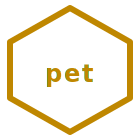

<p align="center">
  
</p>

<h1 align="center">🐾 hexa-pet</h1>

<p align="center"><strong>HEXA-Companion Family</strong> — 5-verb consumer pet-care substrate · spec-first · n=6 lattice · self-contained</p>

<p align="center">
  <a href="LICENSE"></a>
  <a href=".github/workflows/lint.yml"></a>
  
  
  
  
  <a href="https://doi.org/10.5281/zenodo.20102614"></a>
  
</p>

<p align="center">Pets · companions · cat · dog · food · litter · toy · AAFCO · NRC · spec-first · n=6 lattice</p>

---

> 5-verb consumer-pet-care substrate organized around the **n=6 invariant
> lattice**: cat-food / cat-litter / cat-toy / dog-food / dog-toy.
> Friendly self-contained pack — no other hexa-* repo required.

---

## Why

**hexa-pet** is the consumer-friendliest member of the HEXA family. The five
verbs cover the day-to-day surface of cat and dog ownership — food, litter,
toys — at the intersection of consumer-product engineering, animal behavior,
and small-scale material science.

This is the most self-contained pack in the family on purpose: every verb is
a single peer-citable spec doc with physical-limit anchors and a falsifier
preregister, copy-pasted out of the upstream
[`canon/domains/pets/`](https://github.com/dancinlab/canon)
tree (SHA `c0f1f570`, 2026-05-06). No other `hexa-*` repo is needed to use
this one — clone it, read it, hack it.

Why n=6? The HEXA-family lattice gives every verb the same algebraic backbone
(σ(6)=12, τ(6)=4, φ(6)=2, J₂(6)=24), and each verb's spec doc projects that
lattice onto its own physical-limit anchor — bentonite swell ratio, AAFCO
amino-acid registry, nepetalactone vapor pressure, canine bite mechanics,
and so on.

```
                       ┌──────────────────┐
                       │   companion-     │
                       │   animal care    │
                       └────────┬─────────┘
                                │
        ┌───────────────────────┼───────────────────────┐
        │           │           │           │           │
   ┌────▼────┐ ┌────▼────┐ ┌────▼────┐ ┌────▼────┐ ┌────▼────┐
   │cat_food │ │cat_litter│ │ cat_toy │ │dog_food │ │ dog_toy │
   └─────────┘ └─────────┘ └─────────┘ └─────────┘ └─────────┘
     [SPEC]       [SPEC]      [SPEC]      [SPEC]      [SPEC]
```

---

## Status

> **5-verb 반려동물 substrate. Spec-first (working `.hexa` CLI TBD).
> Consumer-friendly self-contained pack.**

What ships at v1.0.0:

- 5 peer-citable spec docs (one `.md` per verb), extracted unchanged from
  `canon@c0f1f570`. These are the source of truth.
- A placeholder CLI dispatcher (`cli/hexa-pet.hexa`) that prints each spec
  doc headline + a 5-verb count selftest.
- `install.hexa` hx hook (mirrors the `hexa-bio` install pattern).
- MIT license — friendly for downstream consumer products + maker remix.

What does NOT ship at v1.0.0 (honest C3 caveats):

1. **No working numerical sandbox yet.** Every verb is spec-only; the CLI
   subcommands print spec headlines, not simulator output. Working `.hexa`
   modules are TBD per the per-verb F-*-MVP-* deadlines (cat-litter and
   cat-food first wave 2026-07-30 ~ 09-30).
2. **Physical-limit anchors are theoretical-analytical.** AAFCO numbers,
   Atwater factors, Wyoming-bentonite swell ratios, nepetalactone vapor
   pressure — all literature-anchored, none lab-measured by this repo yet.
3. **n=6 lattice projections are per-verb hypotheses.** Only the lattice
   itself (σ(6)=12 etc.) is mathematically verified; each verb's projection
   onto that lattice is a working hypothesis pending Bayesian audit per
   F-* gates.
4. **No regulatory pathway.** AAFCO / WSAVA / FAO endorsement is post-MVP;
   nothing here is a medical, veterinary, or nutritional claim.
5. **Consumer-friendly ≠ consumer-tested.** This is a builder substrate, not
   a finished product. No animal trials have been conducted.

---

## Install

```bash
# 1. Install hexa-lang (gives you `hexa` + `hx` package manager)
/bin/bash -c "$(curl -fsSL https://raw.githubusercontent.com/dancinlab/hexa-lang/main/install.sh)"

# 2. Install hexa-pet
hx install hexa-pet
```

---

## Run

```bash
hexa-pet cat_food            # feline obligate-carnivore food spec       [SPEC]
hexa-pet cat_litter          # Wyoming bentonite hygiene material spec   [SPEC]
hexa-pet cat_toy             # nepetalactone prey-mimic toy spec         [SPEC]
hexa-pet dog_food            # facultative-carnivore canine food spec    [SPEC]
hexa-pet dog_toy             # Kevlar/rubber canine chew toy spec        [SPEC]
hexa-pet status              # 5-verb status table + verdict + caveats
hexa-pet selftest            # 5-verb spec doc presence count check
hexa-pet --version           # show version
hexa-pet --help              # full usage
```

---

## Verify

Sister-substrate `verify/run_all.hexa` aggregator pattern, scaled to
the 5-verb consumer-pet substrate. From the repo root:

```bash
hexa run verify/run_all.hexa     # exit 0 = all 4 scripts PASS (100% closure)
```

| script                            | what it checks                                                                          |
| --------------------------------- | --------------------------------------------------------------------------------------- |
| `verify/spec_presence.hexa`       | all 5 verb spec docs present at declared paths                                          |
| `verify/lattice_arithmetic.hexa`  | n=6 self-consistency (σ·φ = n·τ = 24) — *aux only* per `LATTICE_POLICY.md` §1.3         |
| `verify/real_limits_anchor.hexa`  | `LIMIT_BREAKTHROUGH.md` anchors (AVMA/AAHA · AAFCO · FDA-CVM · NRC 2006 · ANSI Z136.1)  |
| `verify/closure_consistency.hexa` | scoreboard cross-check (CLI · `hexa.toml` · README · `AGENTS.md`)                       |

Per `LATTICE_POLICY.md` §1.3, lattice-arithmetic identities are
permitted only as auxiliary self-consistency checks; the substrate's
real verification anchors live in `LIMIT_BREAKTHROUGH.md`:

- **Veterinary medicine** — AVMA / AAHA practice guidelines.
- **Pet nutrition** — AAFCO 2024 nutrient profiles + NRC 2006
  *Nutrient Requirements of Dogs and Cats*.
- **Pet pharmaceuticals** — FDA-CVM (Center for Veterinary Medicine).
- **Material / behaviour anchors** — Wyoming Na-bentonite swell
  (Grim 1978), catnip / nepetalactone (Todd 1962), canine bite
  force (Ellis 2008), ANSI Z136.1 laser MPE (Class IIIa < 5 mW).


- **Pet-medical claims are STRICTLY UNPROVEN** without veterinary IRB.
  This repo is *consumer-product engineering*, not veterinary medicine.
  **Consult a licensed veterinarian for any clinical decision** about
  your animal's diet, health, or treatment.
- Pet-food / pet-pharma / pet-retail brands (Hill's, Royal Canin,
  Purina, Zoetis, Boehringer, Elanco, Petco, Chewy) use **THEIR
  OWN specs** — no lattice-fit is asserted against any external

---

## Repo layout

```
hexa-pet/
├── README.md
├── LICENSE                       MIT
├── CHANGELOG.md
├── hexa.toml                     project manifest
├── install.hexa                  hx install hook
├── cli/
│   └── hexa-pet.hexa             placeholder CLI dispatcher (spec-first)
├── CAT-FOOD.md                   feline obligate-carnivore food spec
├── CAT-LITTER.md                 Wyoming bentonite hygiene material spec
├── CAT-TOY.md                    nepetalactone prey-mimic toy spec
├── DOG-FOOD.md                   facultative-carnivore canine food spec
├── DOG-TOY.md                    Kevlar/rubber canine chew toy spec
├── cat_food/  cat_litter/  cat_toy/  dog_food/  dog_toy/   per-verb working dirs
├── firmware/                     embedded-firmware sibling tree
├── verify/                       4 closure scripts (spec_presence · lattice · real_limits · closure)
├── LATTICE_POLICY.md             n=6 aux-only check policy
├── LIMIT_BREAKTHROUGH.md         AVMA · AAHA · AAFCO · FDA-CVM · NRC anchors
└── AGENTS.tape                   agent identity + repo layout (governance #4)
```

## Provenance

Extracted 2026-05-06 from
[`canon`](https://github.com/dancinlab/canon)
SHA `c0f1f570` (`domains/pets/` subtree). Source files unchanged; directory
`cat_food/` etc.). Sister extraction of:

- [`hexa-bio`](https://github.com/dancinlab/hexa-bio) — molecular
  toolkit (4-verb HEXA family, 1/4 wired)

---

## License

MIT — see [LICENSE](LICENSE).

Author: 박민우 <nerve011235@gmail.com>
